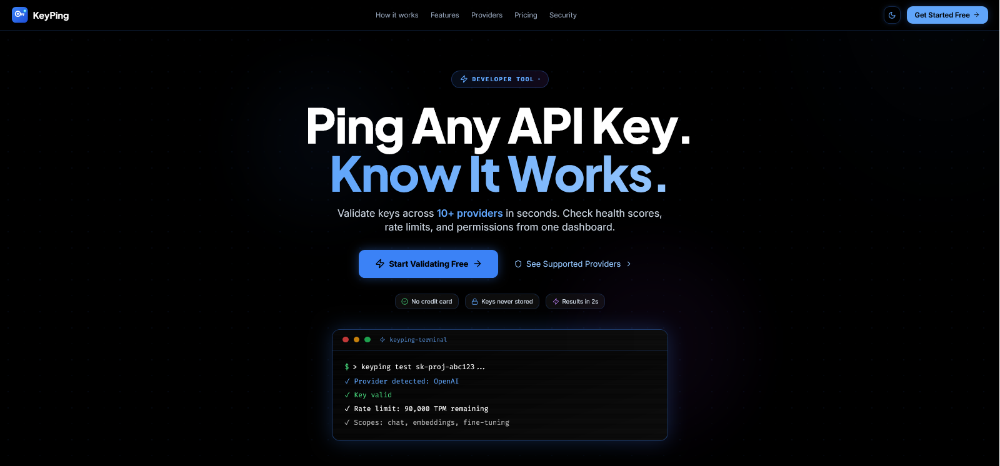

<div align="center">

  <svg xmlns="http://www.w3.org/2000/svg" viewBox="0 0 32 32" fill="none" width="80" height="80">
    <rect width="32" height="32" rx="8" fill="#3B82F6"/>
    <rect width="32" height="32" rx="8" fill="url(#grad)"/>
    <circle cx="12" cy="14" r="5" stroke="white" stroke-width="2.2" fill="none"/>
    <circle cx="12" cy="14" r="2" fill="white"/>
    <rect x="16.5" y="13" width="9" height="2.2" rx="1.1" fill="white"/>
    <rect x="22" y="15.2" width="2" height="2.5" rx="0.8" fill="white"/>
    <rect x="18.5" y="15.2" width="2" height="1.8" rx="0.8" fill="white"/>
    <circle cx="26" cy="8" r="3" fill="#22D3EE" opacity="0.9"/>
    <circle cx="26" cy="8" r="1.5" fill="white"/>
    <defs>
      <linearGradient id="grad" x1="0" y1="0" x2="32" y2="32" gradientUnits="userSpaceOnUse">
        <stop offset="0%" stop-color="#3B82F6"/>
        <stop offset="100%" stop-color="#1D4ED8"/>
      </linearGradient>
    </defs>
  </svg>

# KeyPing

**Validate, monitor, and manage API keys across 10+ providers — in seconds.**

[](https://keyping.vercel.app)
[](LICENSE)
[](https://typescriptlang.org)
[](https://reactjs.org)
[](https://supabase.com)
[](https://tailwindcss.com)
[](https://vitejs.dev)

</div>

---

<div align="center">
  
</div>

---

## Overview

Debugging a broken API key shouldn't take hours. KeyPing lets you paste any API key and get a full validation report — status, health score, rate limits, scopes, and latency — in under 2 seconds. Built for developers and teams who ship fast and can't afford silent key failures in production.

Unlike generic secret managers, KeyPing is purpose-built for API key health: it tells you not just whether a key works, but how well it works, what it can do, and when it's about to expire.

---

## ✨ Features

- 🔑 **Instant Key Validation** — Paste any API key and get a pass/fail result with full details in under 2 seconds
- 📊 **Health Score (0–100)** — Every validation produces a composite score based on validity, rate limits, scopes, and response latency
- ⚡ **Latency Benchmarking** — Measures real round-trip latency to each provider's auth endpoint so you can spot slow keys before they slow down users
- 🧪 **Bulk Testing** — Test up to 10 keys simultaneously across dev, staging, and prod environments; export results as a PDF report
- 🔒 **Secure Key Vault** — Only the last 4 characters of each key are stored; full keys are tested at the edge and immediately discarded
- 🔔 **Expiry Alerts** — Set reminders for key expiry dates with configurable lead times (1, 3, or 7 days before)
- 👥 **Team Workspaces** — Create teams, invite members via shareable links, and manage shared key testing environments
- 📈 **Analytics Dashboard** — Track validation history, provider distribution, health score trends, and latency benchmarks over time
- 🌐 **10+ Supported Providers** — OpenAI, Groq, Anthropic, Stripe, GitHub, Twitter/X, Notion, Supabase, AWS, Gemini, and custom endpoints
- 🎨 **Dark / Light Mode** — Full theme support with smooth transitions
- ⌨️ **Command Palette** — Keyboard-first navigation across the entire app

---

## 🛠 Tech Stack

| Category   | Technology                                          |
| ---------- | --------------------------------------------------- |
| Frontend   | React 18 + TypeScript + Vite                        |
| Styling    | Tailwind CSS v3 + shadcn/ui + Radix UI              |
| Backend    | Supabase (Auth + PostgreSQL + RLS + Edge Functions) |
| Auth       | Supabase Auth (Google OAuth)                        |
| Animations | Framer Motion                                       |
| Charts     | Recharts                                            |
| PDF Export | jsPDF                                               |
| Forms      | React Hook Form + Zod                               |
| State      | TanStack Query v5                                   |
| Deployment | Vercel                                              |

---

## 🚀 Quick Start

### Prerequisites

- Node.js 18+
- pnpm (recommended) or npm
- Supabase account

### Installation

```bash
# 1. Clone the repo
git clone https://github.com/MuhammadTanveerAbbas/Keyping.git
cd Keyping

# 2. Install dependencies
pnpm install

# 3. Set up environment variables
cp .env.example .env.local
# Fill in your values (see Environment Variables section below)

# 4. Run the development server
pnpm dev

# 5. Open in browser
# http://localhost:5173
```

### Supabase Setup

1. Create a new project at [supabase.com](https://supabase.com)
2. Run the migration files in `supabase/migrations/` via the Supabase SQL editor
3. Deploy the edge function: `supabase functions deploy test-api-key`
4. Copy your project URL and anon key into `.env.local`

---

## 🔐 Environment Variables

Create a `.env.local` file in the root directory:

```env
# Supabase
VITE_SUPABASE_URL=https://your-project-id.supabase.co
VITE_SUPABASE_PUBLISHABLE_KEY=your-supabase-anon-key
VITE_SUPABASE_PROJECT_ID=your-project-id
```

Get your keys at [supabase.com](https://supabase.com) → Project Settings → API.

---

## 📁 Project Structure

```
Keyping/
├── public/                  # Static assets (logo, favicon)
├── src/
│   ├── components/          # Reusable UI components
│   │   └── ui/              # shadcn/ui primitives
│   ├── pages/               # Route-level page components
│   ├── hooks/               # Custom React hooks
│   ├── lib/                 # Auth, providers config, utilities
│   └── integrations/
│       └── supabase/        # Supabase client + generated types
├── supabase/
│   ├── functions/
│   │   └── test-api-key/    # Edge function — validates keys server-side
│   └── migrations/          # Database schema migrations
├── .env.example
├── package.json
└── README.md
```

---

## 📦 Available Scripts

| Command           | Description               |
| ----------------- | ------------------------- |
| `pnpm dev`        | Start development server  |
| `pnpm build`      | Build for production      |
| `pnpm build:dev`  | Build in development mode |
| `pnpm preview`    | Preview production build  |
| `pnpm lint`       | Run ESLint                |
| `pnpm test`       | Run tests (single run)    |
| `pnpm test:watch` | Run tests in watch mode   |

---

## 🌐 Deployment

This project is deployed on **Vercel**.

### Deploy Your Own

[](https://vercel.com/new/clone?repository-url=https://github.com/MuhammadTanveerAbbas/Keyping)

1. Click the button above
2. Connect your GitHub account
3. Add environment variables in the Vercel dashboard
4. Deploy

---

## 🗺 Roadmap

- [x] Single key validation with health score
- [x] Bulk key testing (up to 10 keys)
- [x] Secure key vault (last 4 chars only)
- [x] Expiry alerts with configurable reminders
- [x] Team workspaces with invite links
- [x] Analytics dashboard with charts
- [x] PDF export for bulk test reports
- [x] Dark / light mode
- [x] Command palette
- [ ] Email/webhook notifications for expiry alerts
- [ ] REST API for programmatic key validation
- [ ] Mobile app
- [ ] Slack / Discord integration

---

## 🤝 Contributing

Contributions are welcome! Feel free to:

1. Fork the repository
2. Create a feature branch (`git checkout -b feature/amazing-feature`)
3. Commit your changes (`git commit -m 'Add amazing feature'`)
4. Push to the branch (`git push origin feature/amazing-feature`)
5. Open a Pull Request

---

## 📄 License

Distributed under the MIT License. See `LICENSE` for more information.

---

## 👨‍💻 Built by The MVP Guy

<div align="center">

**Muhammad Tanveer Abbas**
SaaS Developer | Building production-ready MVPs in 14–21 days

[](https://themvpguy.vercel.app)
[](https://x.com/themvpguy)
[](https://linkedin.com/in/muhammadtanveerabbas)
[](https://github.com/MuhammadTanveerAbbas)

_If this project helped you, please consider giving it a ⭐_

</div>
