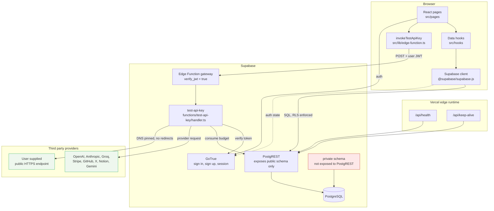
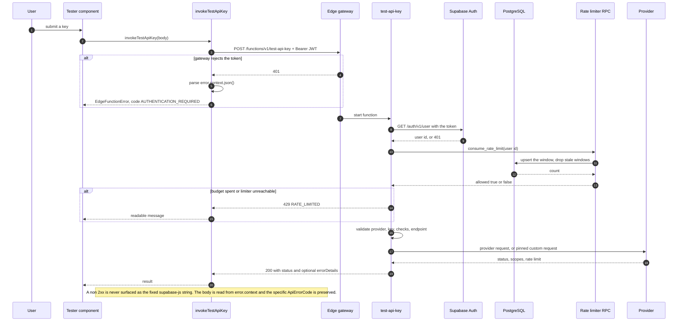
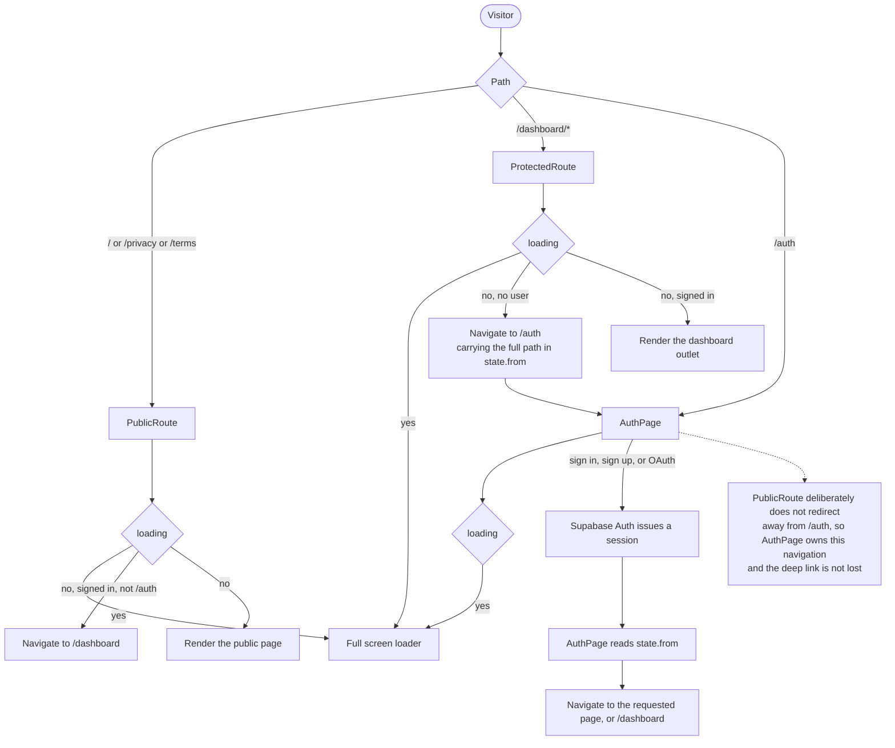
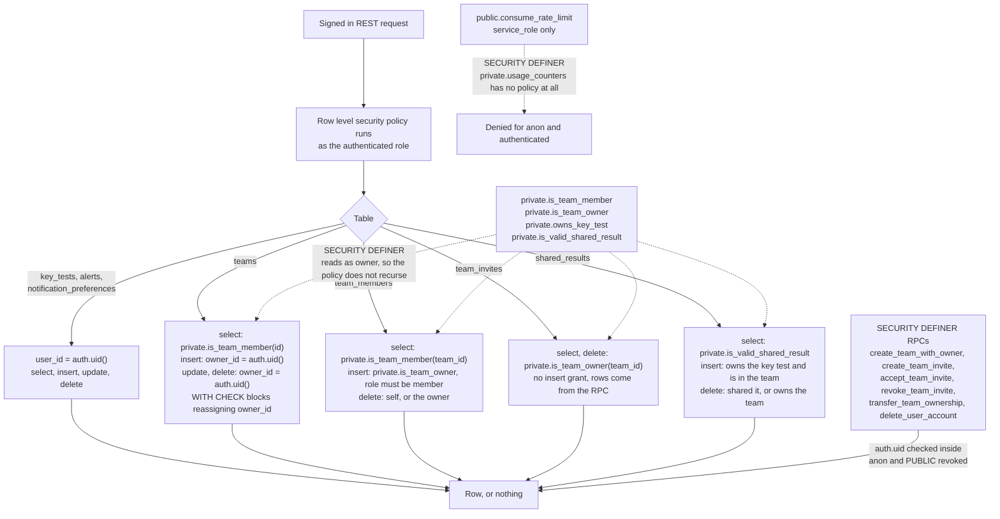
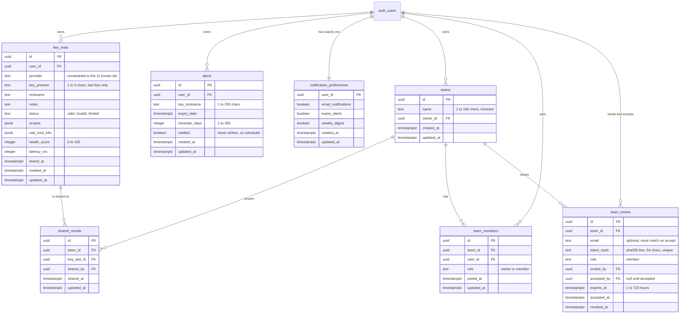
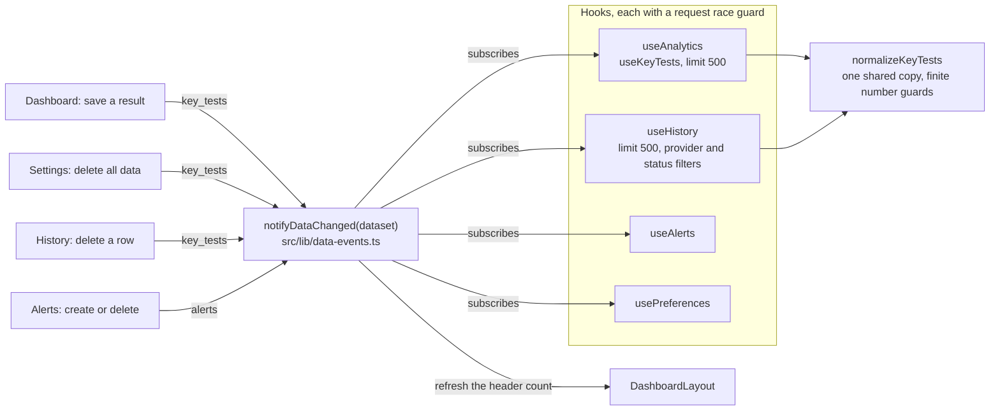
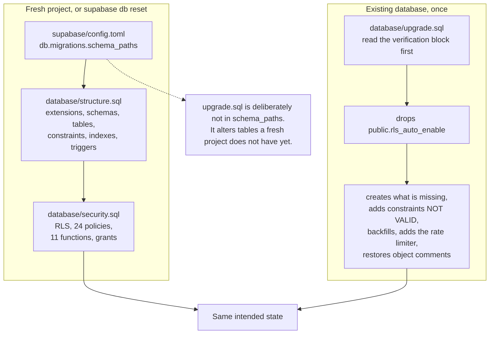
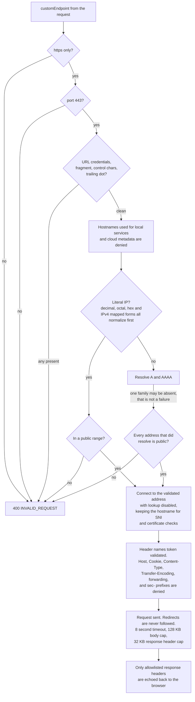

# KeyPing architecture

Every diagram here is derived from the code in this repository. If you change
the implementation, change the matching diagram in the same change.

## System overview

The private schema holds the RLS helper functions and the rate limit counters.
It is not in `api.schemas` in `supabase/config.toml`, so PostgREST never serves
it and no client can call anything inside it over the REST API.

## Validation request and error flow

This is the path every tester uses. The three testers call
`invokeTestApiKey`, so the error payload is parsed in one place.

## Authentication flow

## Authorization and RLS

## Database entity relationship model

`private.usage_counters` is omitted here because it is not part of the user
facing model. It is `(user_id, window_start)` primary key with a request count.
The table lives in `private` and has no policy, so it is unreachable over the
REST API. The function that writes it, `public.consume_rate_limit`, has to live
in `public` because PostgREST only routes functions in a schema listed in
`api.schemas`; it is executable by `service_role` alone.

## Frontend state and refresh flow

Data is fetched by four hand written hooks. There is no query cache library.
Cross page freshness comes from a single typed event.

The guard exists because each hook refetches whenever a dependency changes. A
slow earlier response is discarded when a newer request has already started, and
no hook writes state after unmount.

## Database file layout

## Custom endpoint SSRF controls

Pinning the address while keeping the hostname for TLS is what closes DNS
rebinding: a second lookup cannot redirect the connection after validation, and
the certificate is still verified against the name the user asked for.
